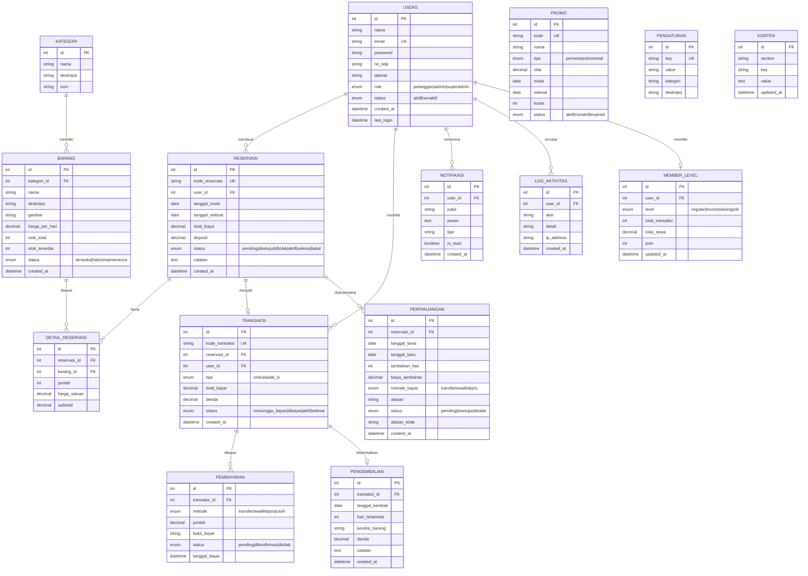
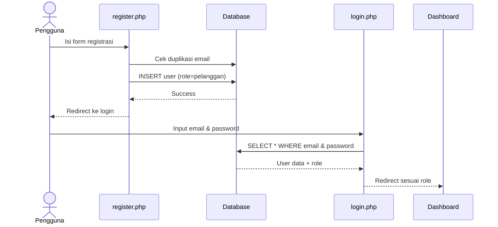
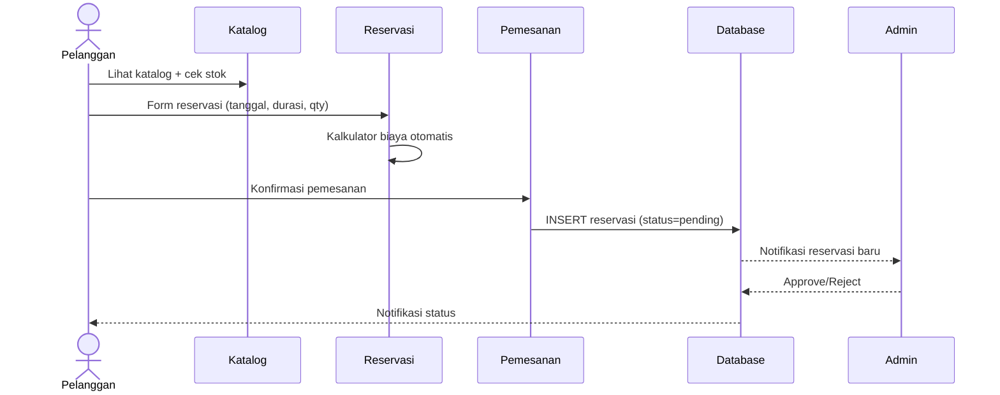
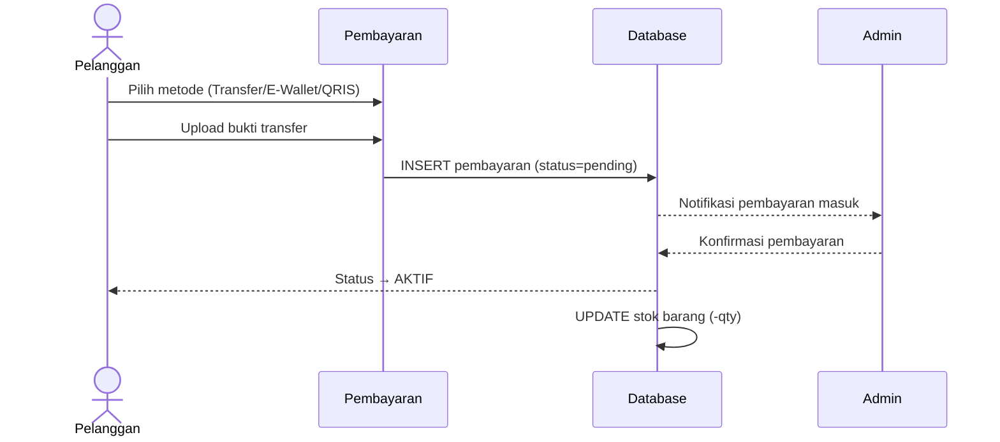
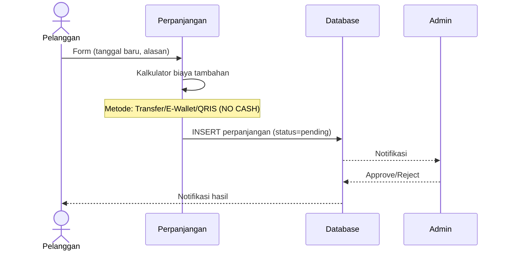
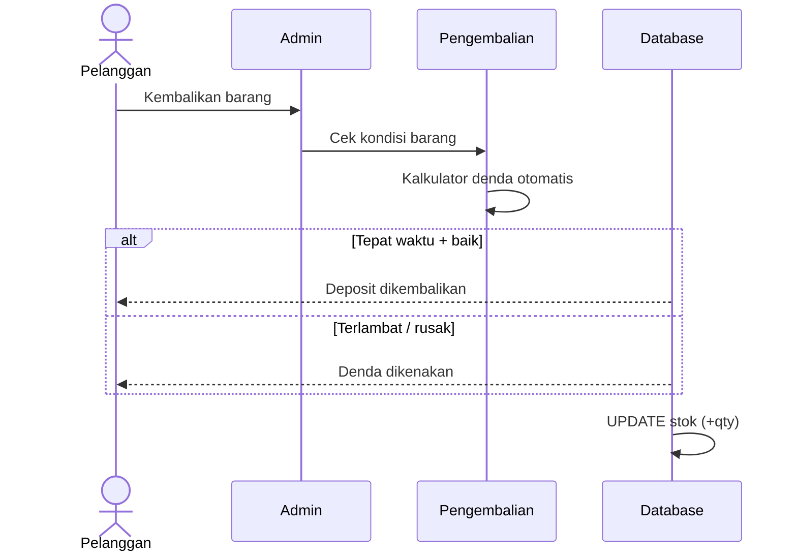
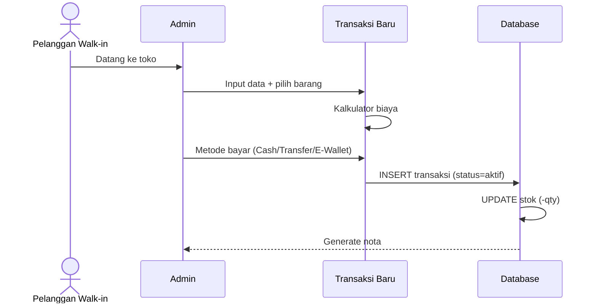
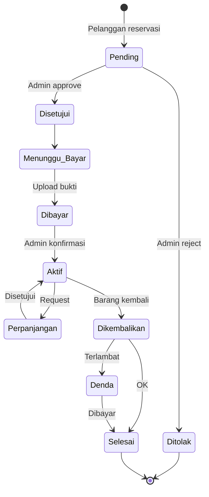

# SIMPEL-CAMP — App Flow & Core Features v2.0

> Sistem Informasi Penyewaan Peralatan Camping  
> Stack: PHP Native + Bootstrap 5.3 + MySQL  
> Terakhir diperbarui: 17 Juni 2026

---

## 📑 Daftar Diagram

| # | Diagram | Format | File |
|---|---------|--------|------|
| 1 | Use Case Diagram (Original) | JPEG | `use_case_original.jpeg` |
| 2 | Use Case Diagram (Extended) | PNG | `use_case_extended.png` |
| 3 | Flowchart Pelanggan | PNG | `flowchart_pelanggan.png` |
| 4 | Flowchart Admin | PNG | `flowchart_admin.png` |
| 5 | Flowchart Super Admin | PNG | `flowchart_superadmin.png` |
| 6 | Activity Diagram (Swimlane) | HTML | `activity_diagram.html` |
| 7 | Sequence Diagram (6 diagram) | HTML | `sequence_diagrams.html` |
| 8 | ERD (15 tabel) | HTML | `erd_diagram.html` |
| 9 | Sitemap | HTML | `sitemap_diagram.html` |
| 10 | Status Lifecycle | HTML | `status_lifecycle.html` |
| 11 | Sequence 1 Registrasi | PNG | `seq_1_registrasi_login.png` |

> Semua file tersimpan di `docs/app_flow/`. File HTML buka di browser untuk render diagram + klik kanan → Save image.

---

## 📋 Ringkasan Proyek

| Item | Detail |
|------|--------|
| **Nama Sistem** | SIMPEL-CAMP |
| **Teknologi** | PHP Native, Bootstrap 5.3, JavaScript, Laragon |
| **Arsitektur** | Multi-user (3 roles: Pelanggan, Admin, Super Admin) |
| **Tipe** | Web-based application |

---

## 📐 Use Case Diagram

### Use Case Diagram Awal (Original)

---

### Use Case Diagram Lengkap (Extended)

Berikut use case diagram yang diperluas sesuai seluruh fitur yang sudah dibangun (29 use case + 4 aktor):

#### Perbandingan Original vs Extended

| Use Case Original (17) | ✅ | Use Case Tambahan Baru (12) |
|-------------------------|:--:|---------------------------|
| Registrasi | ✅ | 🆕 Melakukan Pembayaran Online |
| Login | ✅ | 🆕 Melihat Nota Transaksi |
| Logout | ✅ | 🆕 Melihat Notifikasi |
| Melihat E-Katalog | ✅ | 🆕 Mengelola Profil |
| Melihat Stok | ✅ | 🆕 Melihat Info Member |
| Melakukan Reservasi | ✅ | 🆕 Mengelola Promo |
| Mengajukan Perpanjangan Sewa | ✅ | 🆕 Melihat Dashboard |
| Melihat Status Perpanjangan | ✅ | 🆕 Kelola Konten Website |
| Melihat Riwayat Penyewaan | ✅ | 🆕 Kelola Pengguna |
| Mengelola Data Barang | ✅ | 🆕 Pengaturan Sistem |
| Mengelola Data Pelanggan | ✅ | 🆕 Melihat Log Aktivitas |
| Mengelola Data Reservasi | ✅ | 🆕 Role Super Admin |
| Menginput Transaksi Langsung | ✅ | |
| Konfirmasi Perpanjangan Sewa | ✅ | |
| Memproses Pengembalian Barang | ✅ | |
| Melihat Laporan Penjualan (+cetak) | ✅ | |
| Melihat Laporan Keuangan (+cetak) | ✅ | |

---

## 🔄 Flowchart

### Flowchart Alur Pelanggan

**Keterangan Simbol:**
| Simbol | Warna | Fungsi |
|--------|-------|--------|
| Oval (rounded) | 🔵 Biru muda | Start / End |
| Rectangle | 🟠 Oranye muda | Process |
| Diamond | 🔵 Biru muda | Decision (Ya/Tidak) |
| Parallelogram | 🟡 Kuning muda | Input / Output |

---

### Flowchart Alur Admin

---

### Flowchart Alur Super Admin

---

## 📋 Activity Diagram (Swimlane)

Activity diagram menggunakan swimlane per aktor (Pelanggan / Sistem / Admin) dengan simbol UML standar:
- ● Start/End node
- Rectangle = Action/Process
- ◇ Diamond = Decision
- ═ Synchronization bar

> 📂 Buka file: **[activity_diagram.html](file:///d:/laragon/www/pemweb/docs/app_flow/activity_diagram.html)** di browser

**Isi 2 diagram:**
1. **Activity Diagram 1** — Proses Reservasi & Pembayaran (Login → Katalog → Reservasi → Bayar → Aktif)
2. **Activity Diagram 2** — Perpanjangan & Pengembalian (Perpanjangan → Approval → Pengembalian → Cek Denda → Selesai)

---

## 🗄️ ERD (Entity Relationship Diagram)

---

## 🗺️ Sitemap

```mermaid
graph TD
    ROOT["🌐 SIMPEL-CAMP"]

    ROOT --> PUBLIC["📄 Halaman Publik"]
    PUBLIC --> PUB1["index.php<br>Landing Page"]
    PUBLIC --> PUB2["login.php"]
    PUBLIC --> PUB3["register.php"]
    PUBLIC --> PUB4["logout.php"]

    ROOT --> CUST["🛒 Pelanggan<br>14 Halaman"]
    CUST --> C1["dashboard.php"]
    CUST --> C2["katalog.php"]
    CUST --> C3["detail_barang.php"]
    CUST --> C4["reservasi.php"]
    CUST --> C5["pemesanan.php"]
    CUST --> C6["pembayaran.php"]
    CUST --> C7["transaksi.php"]
    CUST --> C8["perpanjangan.php"]
    CUST --> C9["status_perpanjangan.php"]
    CUST --> C10["riwayat.php"]
    CUST --> C11["nota.php"]
    CUST --> C12["notifikasi.php"]
    CUST --> C13["profil.php"]
    CUST --> C14["member.php"]

    ROOT --> ADM["⚙️ Admin<br>26 Halaman"]
    ADM --> A1["dashboard.php"]
    ADM --> A2["Kelola Barang"]
    A2 --> A2a["kelola_barang.php"]
    A2 --> A2b["barang.php"]
    A2 --> A2c["kategori.php"]
    ADM --> A3["pelanggan.php"]
    ADM --> A4["Transaksi"]
    A4 --> A4a["transaksi.php"]
    A4 --> A4b["reservasi.php"]
    A4 --> A4c["transaksi_langsung.php"]
    A4 --> A4d["perpanjangan.php"]
    A4 --> A4e["pengembalian.php"]
    A4 --> A4f["nota.php"]
    ADM --> A5["Laporan"]
    A5 --> A5a["laporan_penjualan.php"]
    A5 --> A5b["laporan_keuangan.php"]
    ADM --> A6["promo.php"]
    ADM --> A7["kelola_konten.php"]
    ADM --> A8["kelola_pengguna.php"]
    ADM --> A9["sistem.php"]

    ROOT --> SA["🔑 Super Admin<br>3 + Admin"]
    SA --> S1["dashboard.php"]
    SA --> S2["log_aktivitas.php"]
    SA --> S3["profil.php"]
    SA -.->|"akses penuh"| ADM
```

---

## 🔄 Sequence Diagram — Alur Detail

### Flow 1: Registrasi & Login

### Flow 2: Reservasi Online

### Flow 3: Pembayaran

### Flow 4: Perpanjangan Sewa

### Flow 5: Pengembalian

### Flow 6: Walk-in

---

## 📊 Status Lifecycle Transaksi

---

## ⭐ Core Features

### A. Pelanggan (14 Halaman)

| # | Fitur | Deskripsi |
|---|-------|-----------|
| 1 | Dashboard | Ringkasan transaksi, notifikasi, grafik |
| 2 | E-Katalog | Browse barang, filter, search, promo |
| 3 | Detail Barang | Info, foto, harga, stok, tombol sewa |
| 4 | Reservasi | Form + kalkulator biaya otomatis |
| 5 | Pemesanan | Ringkasan sebelum bayar |
| 6 | Pembayaran | Upload bukti (Transfer/E-Wallet/QRIS) |
| 7 | Transaksi | Daftar aktif & riwayat |
| 8 | Perpanjangan | Form + estimasi biaya (TANPA CASH) |
| 9 | Status Perpanjangan | Tracking pending/disetujui/ditolak |
| 10 | Riwayat | History transaksi selesai |
| 11 | Nota | Cetak nota |
| 12 | Notifikasi | List notifikasi |
| 13 | Profil | Edit data diri |
| 14 | Member | Level & benefit |

### B. Admin (26 Halaman)

| # | Menu | Fitur |
|---|------|-------|
| 1 | Dashboard | Statistik, grafik, barang populer |
| 2-5 | Kelola Barang | CRUD barang + kategori |
| 6 | Data Pelanggan | Daftar + detail per pelanggan |
| 7-13 | Transaksi | Reservasi, walk-in, perpanjangan, pengembalian, nota |
| 14-16 | Laporan | Penjualan & keuangan + cetak |
| 17 | Kelola Konten | Beranda, Tentang, FAQ, Footer |
| 18 | Promo | CRUD promo (terpisah dari konten) |
| 19 | Kelola Pengguna | CRUD user + role + status |
| 20 | Sistem | Umum, sewa, keamanan, health, log |

### C. Super Admin (3 + akses Admin)

| # | Fitur |
|---|-------|
| 1 | Dashboard global + revenue chart |
| 2 | Log aktivitas (audit trail) |
| 3 | Profil |
| + | Akses penuh ke semua halaman Admin |

---

## 🔐 Metode Pembayaran

| Fitur | Cash | Transfer | E-Wallet | QRIS |
|-------|:----:|:--------:|:--------:|:----:|
| Walk-in (Admin) | ✅ | ✅ | ✅ | ❌ |
| Reservasi Online | ❌ | ✅ | ✅ | ✅ |
| Perpanjangan | ❌ | ✅ | ✅ | ✅ |
| Denda | ✅ | ✅ | ✅ | ❌ |

---

## 🎨 Design System

| Token | Nilai | Penggunaan |
|-------|-------|------------|
| Primary Dark | `#1B4332` | Sidebar, heading |
| Primary Mid | `#2D6A4F` | Button, accent |
| Primary Light | `#52B788` | Hover, badge |
| Gold | `#D4A373` | Super Admin accent |
| Font Heading | `Outfit` | h1-h6 |
| Font Body | `Inter` | Paragraf, teks |
| Font Mono | `JetBrains Mono` | Harga, ID, kode |

---

## 📋 Checklist Backend

- [ ] Setup database MySQL + 15 tabel (ERD di atas)
- [ ] Autentikasi (login, register, session, RBAC)
- [ ] CRUD Barang + upload foto
- [ ] CRUD Kategori
- [ ] Reservasi: create, approve, reject
- [ ] Transaksi: create, update status
- [ ] Pembayaran: upload bukti, konfirmasi
- [ ] Perpanjangan: create, approve, reject, kalkulasi
- [ ] Pengembalian: proses, kondisi, denda
- [ ] Laporan: query + export/cetak
- [ ] Notifikasi: create, mark read
- [ ] Promo: CRUD + validasi periode
- [ ] Member: level up otomatis
- [ ] Pengaturan sistem: key-value store
- [ ] Log aktivitas: auto-log
- [ ] Kelola konten: CRUD
- [ ] Kelola pengguna: CRUD + toggle status
